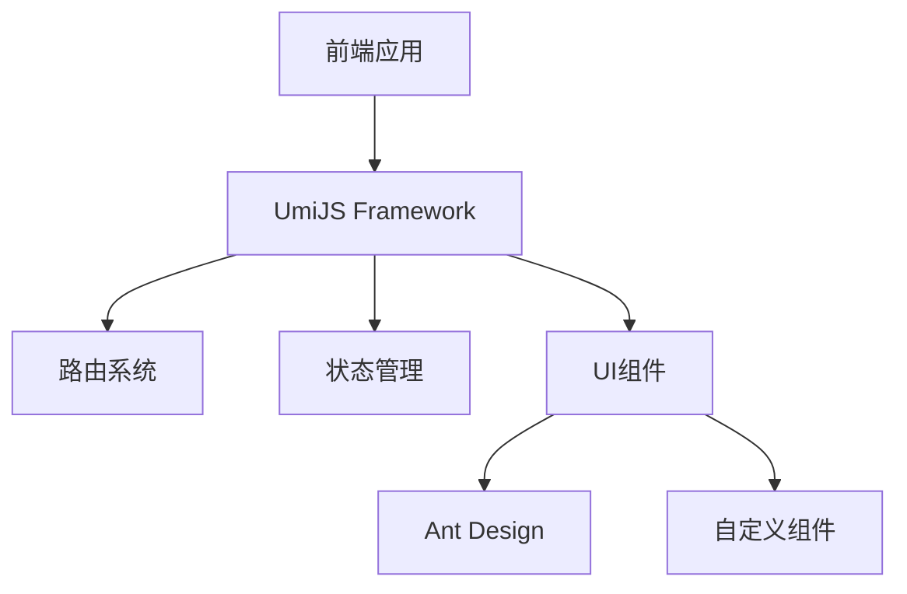
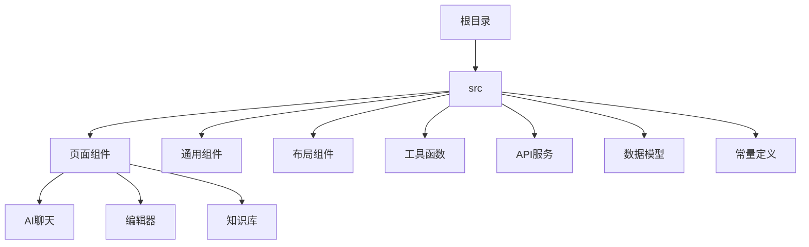
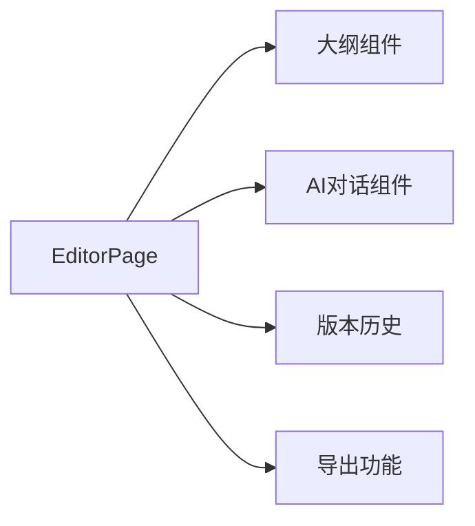
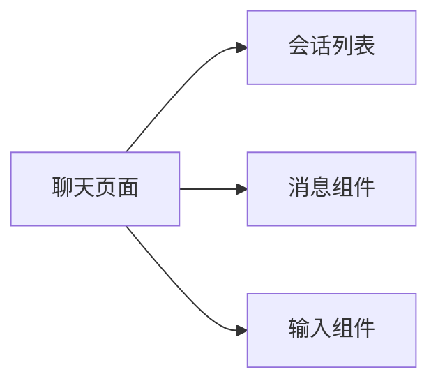
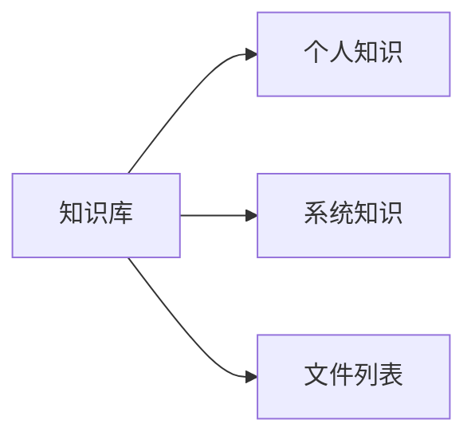
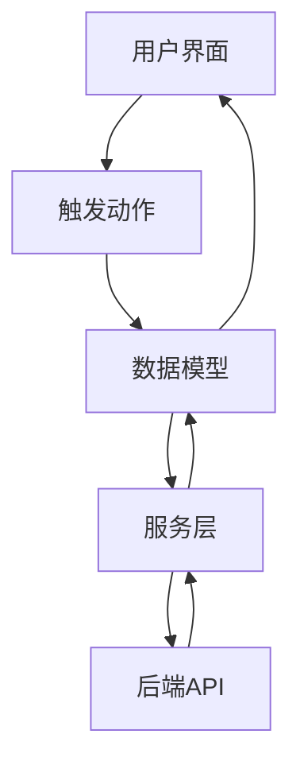

# 系统架构设计模式

## 整体架构

### 技术架构

### 目录结构

## 核心设计模式

1. 状态管理模式

   - 使用 UmiJS Model 进行全局状态管理
   - 组件内部状态使用 React Hooks
   - 状态更新遵循单向数据流

2. 组件设计模式

   - 容器组件/展示组件分离
   - 高阶组件用于功能复用
   - Hooks 模式用于状态和副作用管理

3. 路由管理模式
   - 基于配置的路由系统
   - 权限控制路由访问
   - 动态路由加载

## 关键组件关系

### 编辑器模块

### AI 聊天模块

### 知识库模块

## 代码组织原则

1. 组件设计原则

   - 单一职责
   - 接口隔离
   - 依赖倒置
   - 组件可复用

2. 文件组织规范

   - 按功能模块划分
   - 组件资源内聚
   - 共享资源集中管理
   - 统一的命名规范

3. 状态管理规范
   - 合理的状态粒度
   - 清晰的状态更新流程
   - 避免状态冗余
   - 性能优化考虑

## 交互流程

### 数据流动

### 组件通信

1. 父子组件

   - Props 向下传递
   - 回调函数向上通信
   - Context 共享状态

2. 跨组件通信
   - 全局状态管理
   - 发布订阅模式
   - 依赖注入

## 性能优化模式

1. 渲染优化

   - 合理的组件拆分
   - React.memo 缓存
   - 虚拟列表

2. 数据优化

   - 数据缓存策略
   - 按需加载
   - 防抖和节流

3. 资源优化
   - 代码分割
   - 路由懒加载
   - 资源预加载
